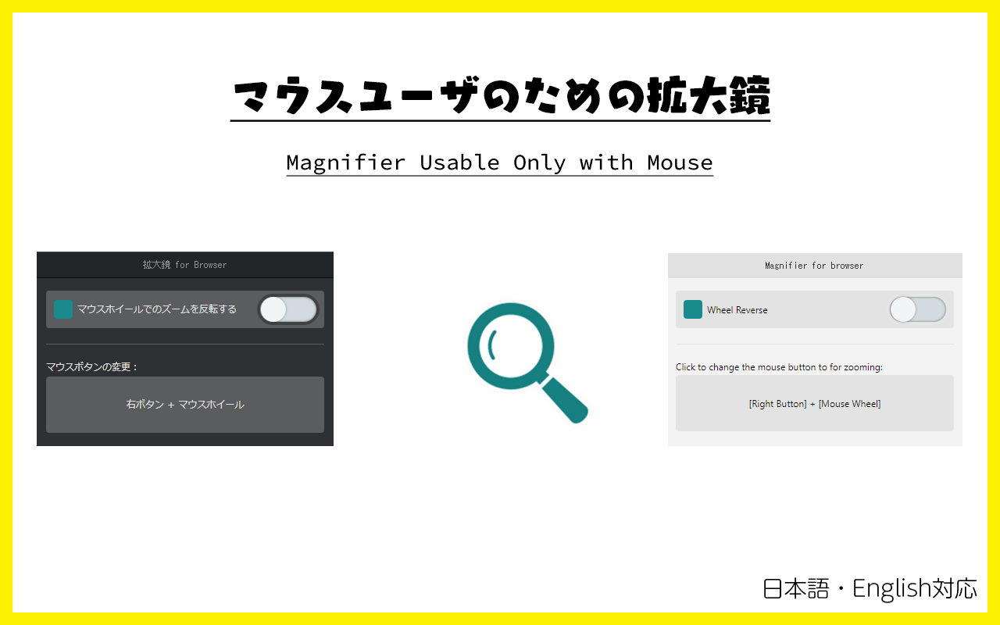

# 拡大鏡 for Browser

 

Windows Explorer にある「上の階層に移動」ボタンのブラウザ版です。

[English version](./README.md)

## Download

Google Chrome にインストールするにはこちらをクリックしてください。

## 使い方

1. コンテキストメニュー（右クリックメニュー）を開く
2. "拡大鏡 for Browser" をクリック
3. 右マウスボタンを押したまま、マウスホイールをまわす

画面端にマウスカーソルを持っていくと、その方向にスクロールできます。

### 設定

- マウスカーソルでスクロールする機能はコンテキストメニューから無効・有効を切り替えられます
- **デフォルトは右マウスボタン**を使いますが、拡張一覧のアイコンをクリックすると他のボタンに変更できます
- マウスホイールの方向による拡大縮小は逆転させられます
