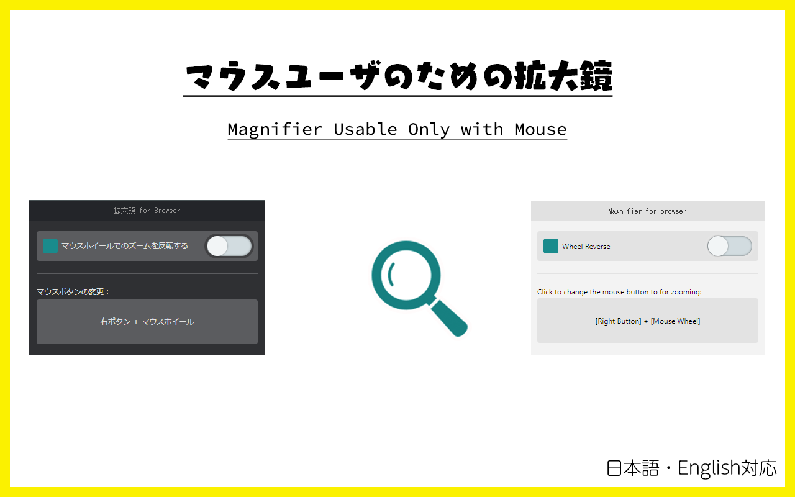

# Magnifier Usable Only with Mouse

 

The browser version of the 'Up One Level' button found in Windows Explorer.

[日本語はこちら](./README--ja.md)

## Download

Install it on your Google Chrome from here.

## How To Use

1. Open the context menu.
2. Click on "Magnifier for browser".
3. Hold down the right mouse button and use the mouse wheel.

When you move the mouse cursor to the edge of the screen, you can scroll in that direction.

### Config

- The scroll with mouse cursor function can be enabled or disabled from the context menu.
- **By default, it uses the right mouse button**, but you can change it to other buttons by clicking on the icon in the extension list.
- You can reverse the zoom direction based on the mouse wheel.
